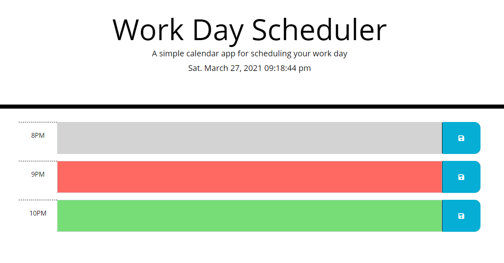
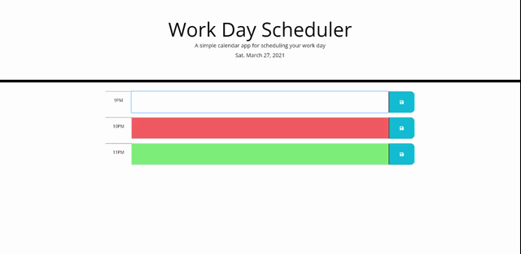

# Day Planner


## Function

This appliaction is a simple calendar that allows a user to save events for each hour of the day.

This application uses the moments library [Moment.js](https://momentjs.com/) to work with date and time.


## User Story

Given I am using a daily planner to create a schedule

```
WHEN I open the planner
THEN the current day is displayed at the top of the calendar

WHEN I scroll down
THEN I am presented with timeblocks for standard business hours

WHEN I view the timeblock for that day
THEN each timeblock is color-coded to indicate whether it is in the past, present, or future

WHEN I click into a timeblock
THEN I can enter an event

WHEN I click the save button for that timeblock
THEN the text for that event is saved in local storage

WHEN I refresh the page
THEN the saved events persist
```


## Screenshot

The following image shows the web application's appearance:




## Gif

The following image shows the web application's functionality:




## Links

* Deployed application: https://cmonge135.github.io/my-day-planner/

* Github repositiory: https://github.com/Cmonge135/my-day-planner